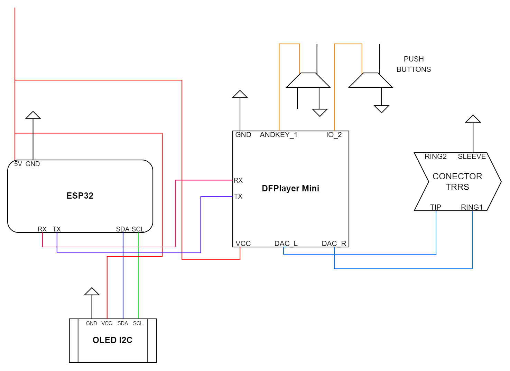

## Sobre

Este trabalho foi proposto durante a disciplina de Sistemas Embarcados, matéria ministrada ao longo do quinto período de Engenharia de Computação.

## Objetivo

O projeto possui como objetivo criar um dispositivo compacto que simule a audiometria, um exame que avalia o nível da audição de um indivíduo. O aparelho não substituirá uma consulta especializada, mas poderá servir como triagem, uma vez que tomará menos tempo que um procedimento completo e poderá ser realizado de casa.

## Materiais utilizados

A seguir está uma lista dos componentes eletrônicos usados no projeto

- Microcontrolador ESP32
- Módulo MP3 DFPlayer Mini
- Cartão microSD de 4GB
- Módulo Adaptador Plug MP3 3.5mm
- Display OLED 128x64 0.96" I2C
- Resistores
- Botões
- Jumpers/Fios

## Diagrama do Hardware

## Créditos

### Integrantes do grupo

- [Gabriel Cecconello](https://www.linkedin.com/in/gabriel-cecconello/)
- [Paula Talim](https://www.linkedin.com/in/paulatalim/)
- [Rafael Vicente](https://www.linkedin.com/in/rafael-vicente-8726a6204/)

### Professor Orientador

- [Mário Buratto](https://www.linkedin.com/in/mario-buratto-047b3630/)

